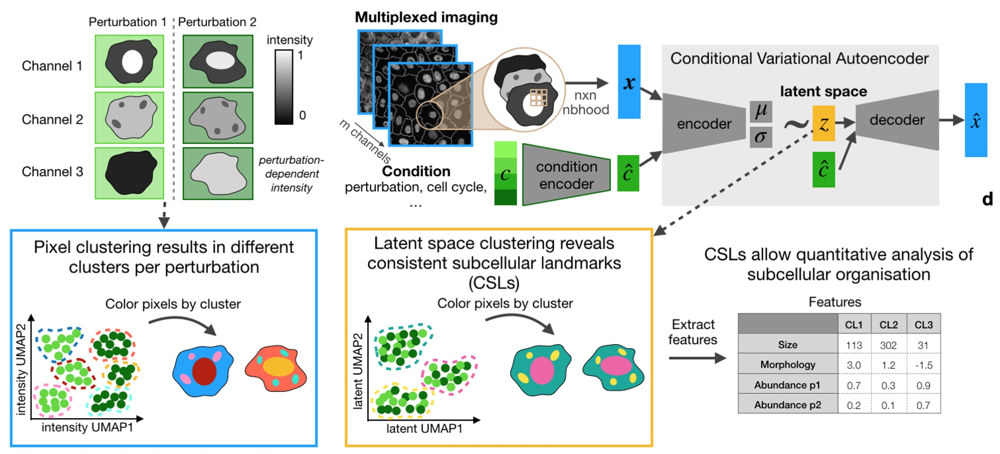

CAMPA - Conditional Autoencoder for Multiplexed Pixel Analysis
~~~~~~~~~~~~~~~~~~~~~~~~~~~~~~~~~~~~~~~~~~~~~~~~~~~~~~~~~~~~~~

CAMPA is a framework for quantiative analysis of subcellular multi-channel imaging data.
It consists of a workflow that generates consistent subcellular landmarks (CSLs)
using conditional Variational Autoencoders (cVAE).
The output of the CAMPA workflow is an `anndata`_ object that contains interpretable
per-cell features summarizing the molecular composition
and spatial arrangement of CSLs inside each cell.

Manuscript
----------
Please see our preprint
*"Learning consistent subcellular landmarks to quantify changes in multiplexed protein maps"*
(`Spitzer, Berry et al. (2022)`_) to learn more.

Contributing
------------
We are happy about any contributions! Before you start, check out our `contributing guide`_.

.. toctree::
   :maxdepth: 2
   :caption: Contents
   :hidden:

   installation
   overview
   api
   classes
   cli
   tutorials

.. _anndata: https://anndata.readthedocs.io/en/stable/
.. _contributing guide: https://github.com/theislab/campa/blob/main/CONTRIBUTING.rst
.. _`Spitzer, Berry et al. (2022)`: https://www.biorxiv.org/content/10.1101/2022.05.07.490900v1
